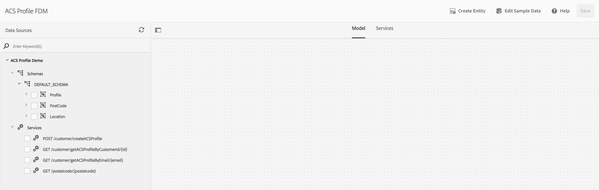
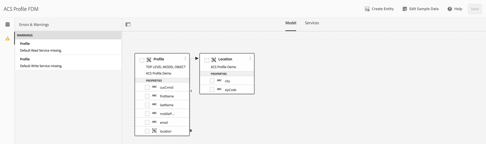
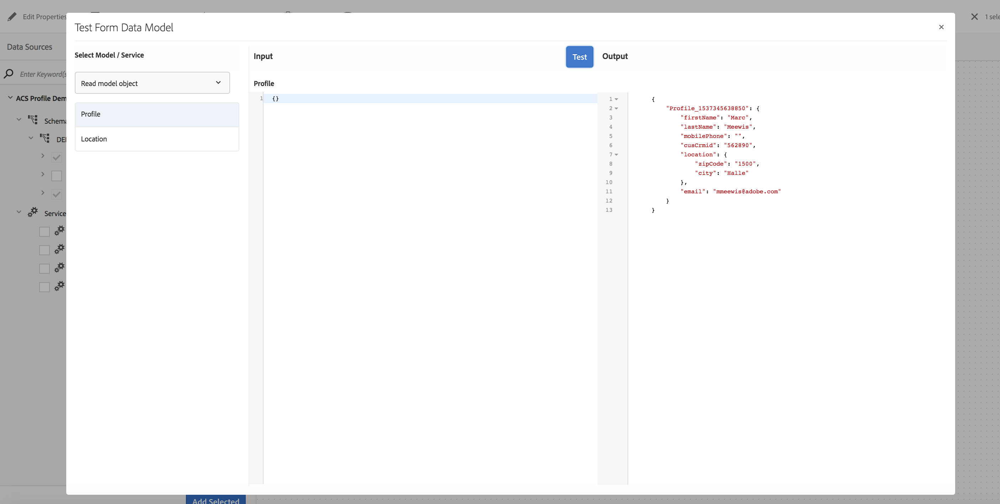
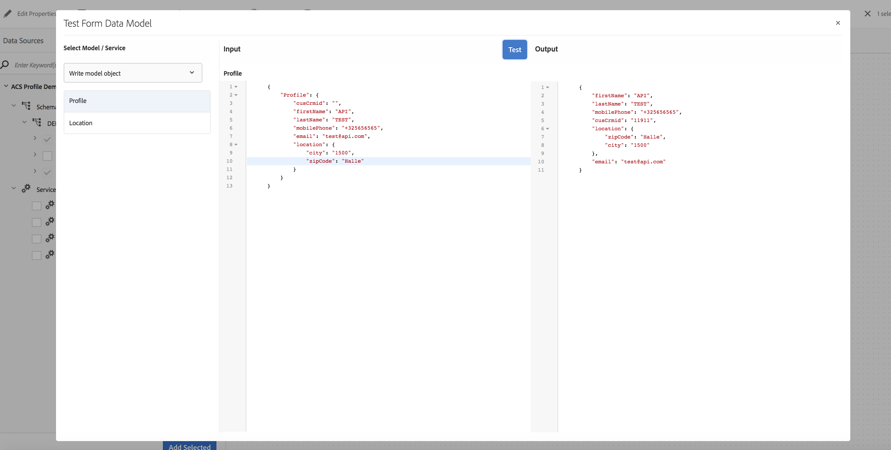
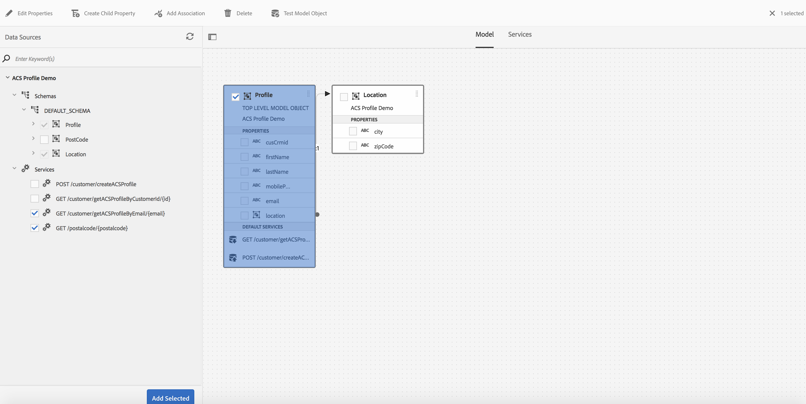

# FDM
Forms Data Model - JSON Schema

## Setup

* Install Node.js

* Install the following packages (npm install)
  * express
  * request
  * body-parser
  * fs
  * axios
  * jsonwebtoken

* Copy your private key into the folder where you will run acs-profile.js

* Edit acs-profile.js
  
  * From the adobe.io console copy the JWT for your integration and paste it to the jwtPayload object
  
```javascript
// get your jwtPayload from the adobe.io console

var jwtPayload = {
    "exp": 1537388667,
    "iss": "xxxxxxx@AdobeOrg",
    "sub": "xxxxxxx@techacct.adobe.com",
    "https://ims-na1.adobelogin.com/s/ent_campaign_sdk": true,
    "aud": "https://ims-na1.adobelogin.com/c/xxxxxxxxxxxxxxxxxx"
};
```
  * Replace the "exp" by "exp": tomorrow.getTime() so that it looks like:

```javascript
// get your jwtPayload from the adobe.io console

var jwtPayload = {
    "exp": tomorrow.getTime(),
    "iss": "xxxxxxx@AdobeOrg",
    "sub": "xxxxxxx@techacct.adobe.com",
    "https://ims-na1.adobelogin.com/s/ent_campaign_sdk": true,
    "aud": "https://ims-na1.adobelogin.com/c/xxxxxxxxxxxxxxxxxx"
};
```
  
  * Copy your clientId and clientSecret from the adobe.io console and paste it into the code
  
```javascript
// get your clientId and clientSecret from the adobe.io console
var clientId = 'xxxxxxxxxxxxxxxxxxx';
var clientSecret = 'xxxxxxxxxxxxxxxxxx';
```

## Run

* node acs-profile.js

## Define a datasource in AEM

* Navigate to (http://localhost:4502/libs/fd/fdm/gui/components/admin/fdmcloudservice/fdm.html/conf)
* Open "Global" and hit "Create"
* Enter name and title and select "RESTful" service as the Service Type
* Next
* Select "File" as the Swagger source
* Browse and uplaod "acs-swagger-datamodel-v3.json"
* Create

## Create the Forms Data Model in AEM

* Navigate to (http://localhost:4502/aem/forms.html/content/dam/formsanddocuments-fdm)
* Create
* Enter a name and select "Global" as your "Data Source Configuration"
* Next
* Select your data source created in the previous step
* Save and open in "Edit"



## Define the read/write methods

* Select "Profile" under "DEFAULT SCHEMA" and "Add Selected"
* In the dialog, click "Add"
* Save


  
* In the "Model" window select "Profile" (it should turn blue when properly selected)
* In the top menu, select "Edit Properties"
* In the "Edit Properties" panel select
   * "GET /customer/getACSProfileByCustomerId/{id}" as your read service
   * "POST /customer/createACSProfile" as your write service
   
### Define how the parameter for the read service should be identified
* Edit the "Id" GET argument (a dialog appears)
* Select "Literal" and enter a known Adobe Campaign Standard "Customer Id" (requires data model extension)
* Done, Done, Save

### Test your read service
* Select the "Profile" enity in the Model (should turn blue when selected)
* From the top menu select "Test Model Object"
* Make sure everything is set as shown in the screen below:



* You should see your ACS Profile result in the output panel

### Test your write service
* In the "Test Model Object" screen, Select "Write Model Object" for the "Profile" entity
* A pre-populated object will be generated
* Edit the "Profile" properties (if you hit test, the profile will be created in your Adobe Campaign instance
* You can leave cusCrmid empty, it will be assigned by the service
* Hit "Test", the result should look like the screen below (cusCrmid has now a value)



### Additional services

The json schema exposes some additional services that can be used to optimize the form filling experience:

#### Fetch a ACS Profile via its email address

This method can be invoked as part of a field change rule, whenever the email field is updated, the profile information associated with the email is fetched from campaign and will be used to prefill a form fields.

#### Fetch a Postalcode information

This method can be invoked as part of a field change rule, whenever the postalcode field is updated, the city information will be fetched using a Belgian postalcode service.



* As shown in the screen above, select the two services and hit "Add Selected"

